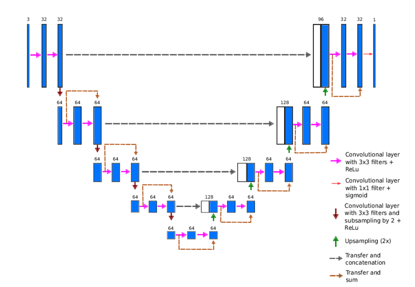

# Artificial Intelligence Neuroevolution
# Medical Image Processing
- Author: Jesus Ramseths Echeverria

 This project is for educational purposes, if you want to take it to production environments **300, 000** official **MRI** images are required, in addition to evaluate the metrics of each model implemented in this project.

## What is image segmentation?

The objective is to understand and extract information from images at the pixel level. It is used for object localization and recognition, some applications are medical imaging and autonomous cars. A neural network is trained to produce a pixel mask.

State-of-the-art techniques are based on a deep learning approach that makes use of common architectures such as **CNN**, **TCN** and **deep encoder-decoders**. The **ResUNet** architecture was used in this project.

### Res-U-Net Architecture

